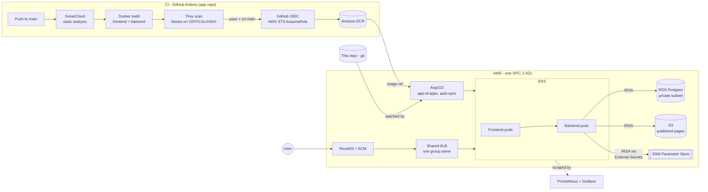

# eks-configuration

Infrastructure and Kubernetes config for the [Three-Tier-Kubernetes-DevSecOps-Project](https://github.com/justthatpixel/Three-Tier-Kubernetes-DevSecOps-Project) app — deliberately a separate repo from the application code, so infra changes and app changes have independent histories, reviews, and CI.


<!-- Drop your demo gif at docs/demo.gif — this line renders it automatically. -->

## Overview

A production-shaped path from `git push` to a running EKS workload, with security gates that actually block and no long-lived credentials anywhere in the chain:

**CI (app repo)** → static analysis and a container vulnerability scan gate the build → images push to ECR via GitHub's OIDC identity, not a stored AWS key → **CD (this repo)** → ArgoCD watches this repo and syncs the app, monitoring stack, and its own upgrades into EKS, self-healing any drift automatically.

The application itself (Next.js + NestJS + Postgres) is intentionally small — it exists to be a real workload to build this platform around, not the point of the project.

## Architecture



Everything downstream of ECR — the app, monitoring stack, and ArgoCD's own upgrades — is GitOps-managed: nothing gets `kubectl apply`'d by hand except the one-time bootstrap.

## Key Features

- **Terraform (IaC):** modular, version-controlled AWS provisioning — VPC, EKS, RDS, S3, ECR, Route53/ACM — with a separate bootstrap state to solve the chicken-and-egg problem of the state bucket describing itself.
- **IRSA (IAM Roles for Service Accounts):** every in-cluster workload that touches AWS (ALB controller, External Secrets, the backend's S3 access, the EBS CSI driver) gets its own least-privilege IAM role, instead of one broad role shared by every pod on a node.
- **Keyless CI/CD:** GitHub Actions authenticates to AWS via OIDC federation — no static access keys stored anywhere, ever. A short-lived token is exchanged for temporary credentials on every run.
- **Security gates that block, not just report:** Trivy fails the pipeline on CRITICAL/HIGH findings before an image can reach ECR. Every finding in this project was root-caused and fixed at the source (an upstream tool's bundled dependency, a transitive package pin, a stale base-image layer) rather than suppressed by lowering the threshold.
- **GitOps with ArgoCD:** app-of-apps pattern with scoped `AppProject`s, automated sync and self-healing — a manual change to a live Deployment gets reverted automatically within seconds, because git is the source of truth, not whatever's running.
- **Secrets never touch a values file:** External Secrets Operator pulls `DATABASE_URL`/`AUTH_SECRET` from SSM Parameter Store at runtime via its own IRSA role.
- **Cost-aware by default:** every workload's Ingress shares a single ALB via `group.name` instead of provisioning one each; S3/ECR use `force_destroy`/`force_delete` so a demo teardown doesn't get stuck on non-empty resources.
- **Observability:** kube-prometheus-stack (Prometheus + Grafana), deployed and managed the same GitOps way as the application.
- **Local-first development:** the full stack runs on a local `kind` cluster before ever touching AWS, so the Helm charts and GitOps config are validated cheaply and repeatedly.

## Why This Setup Matters

- **No standing credentials to leak.** OIDC federation for CI and IRSA for in-cluster workloads mean there is no long-lived AWS key sitting in GitHub secrets or baked into a container image anywhere in this system.
- **Drift doesn't survive.** ArgoCD's automated self-heal means a manual `kubectl edit` in production gets silently reverted — the only way to change what's running is to change git.
- **The pipeline fails loudly, on purpose.** A vulnerable image cannot reach the registry; the failure is the feature.
- **Every module is reusable.** `terraform/modules/*` isn't tangled into one monolithic root — network, EKS, RDS, IRSA, DNS, and ECR are each independent and composable.

## Infrastructure Components

| Component | Purpose |
|---|---|
| **VPC** (2 AZs) | Public/private subnet split, NAT gateway, isolated network for the cluster |
| **EKS** | Managed control plane + node group, with `vpc-cni`/`coredns`/`kube-proxy`/`aws-ebs-csi-driver` add-ons |
| **RDS (Postgres)** | Private-subnet-only, encrypted at rest, reachable only from the EKS security groups |
| **S3** | Published static pages (app-writable via IRSA) |
| **ECR** | Immutable-tagged, scan-on-push image repositories |
| **Route53 + ACM** | Looks up an *existing* hosted zone (doesn't create one) and issues a DNS-validated wildcard certificate |
| **IRSA roles** | Per-workload IAM: ALB controller, External Secrets, backend S3 access, EBS CSI |
| **SSM Parameter Store** | `DATABASE_URL`/`AUTH_SECRET`/Grafana admin password — read in-cluster via External Secrets Operator |
| **ArgoCD** | GitOps controller — app-of-apps, scoped `AppProject`s, automated sync |
| **kube-prometheus-stack** | Prometheus + Grafana, deployed via the same GitOps path as the app |

## Repo Structure

```
kind/           the Kubernetes side — Helm chart + ArgoCD config, verified on a local kind cluster
  project/        the app chart (umbrella: backend/frontend subcharts)
  argocd/         GitOps: AppProject, app-of-apps, Applications (kind + EKS variants)
  monitoring/     kube-prometheus-stack values (Prometheus + Grafana)
terraform/      the AWS side — VPC, EKS, RDS, S3, ECR, Route53+ACM, IRSA
  bootstrap/      one-time: S3 bucket for remote state
  modules/        network, dns, eks, ecr, rds, s3, irsa
  live/           the root module wiring them together
```

Single environment throughout — one cluster, one namespace, no dev/uat/prod split. That's a deliberate scope choice for a portfolio project, not a limitation of the pattern; every module here composes cleanly into a multi-environment layout.

## This repo assumes the app repo is checked out alongside it

Building the Docker images for `kind` needs both repos on disk:

```
some-directory/
  Three-Tier-Kubernetes-DevSecOps-Project/   <- the app
  eks-configuration/                          <- this repo
```

## Setup

### Run it locally first (kind)

Start with [kind/README.md](kind/README.md) — no AWS account needed, validates the full chart + GitOps config on a local cluster.

### Then bring up the real thing on AWS

1. `cd terraform/bootstrap && terraform init && terraform apply -var="state_bucket_name=<your-unique-name>"` — one-time, creates the remote state bucket.
2. In `terraform/live`: point at that bucket without hardcoding it —
   ```sh
   echo 'bucket = "<your state bucket name>"' > backend.hcl   # gitignored
   terraform init -backend-config=backend.hcl
   ```
3. Copy `terraform/live/terraform.tfvars.example` to `terraform.tfvars` (also gitignored) and fill in your own domain and bucket names.
4. `terraform plan && terraform apply`.
5. Terraform stops at the cluster boundary — see [terraform/live/README.md](terraform/live/README.md) for what still needs installing inside the cluster (ALB controller, StorageClass, ArgoCD bootstrap) before ArgoCD can take over.

Nothing in this repo needs a real AWS account ID, domain, or ARN hardcoded anywhere — every real value is either a gitignored local file (`terraform.tfvars`, `backend.hcl`) or an explicit `<PLACEHOLDER>` in the handful of files ArgoCD reads directly from git (`kind/project/values-eks.yaml`, `kind/monitoring/values-eks.yaml`, `kind/argocd/applications-eks/argocd.yaml` — each documents exactly which `terraform output` fills it in).

## Teardown

```sh
kubectl delete ingress --all -A          # let the ALB controller clean up the ALB it created —
                                          # Terraform has no record of that resource and can't do this for you
terraform destroy                        # in terraform/live
terraform destroy                        # in terraform/bootstrap, only after live/ is gone
```

The ALB, its target groups, and its security group are created by the AWS Load Balancer Controller reacting to `Ingress` objects, not by Terraform — deleting the Ingresses *first* and confirming the ALB is actually gone (`aws elbv2 describe-load-balancers`) avoids orphaning it before tearing down the VPC underneath it.

## Status

Built, applied, and verified end-to-end on real AWS — cluster up, app live behind the ALB with a real domain and TLS cert, ArgoCD syncing, monitoring running, CI pushing through OIDC with Trivy actually blocking bad images. Infrastructure was subsequently torn down after verification to stop the AWS bill; every step above is what it takes to bring it back up from zero.

## What's Next

- **ArgoCD CLI access** — the ALB Ingress only serves the web UI today (`controller: generic`, not `aws`'s gRPC-aware mode); `argocd login` still needs a port-forward.
- **Autoscaling** — no HPA or Cluster Autoscaler/Karpenter wired up yet; node/pod counts are static.
- **Multi-environment** — every module already composes cleanly into dev/uat/prod; the single-environment scope here is a portfolio choice, not a structural limit.
